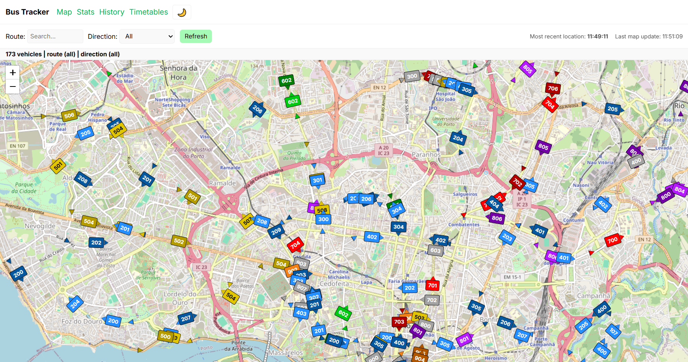

# Bus Tracker (FIWARE → Postgres/PostGIS → Map)

A Dockerized application that fetches real-time bus positions from the Porto Digital FIWARE NGSIv2 broker every minute, stores both **latest** and **historical** data in **Postgres/PostGIS**, and displays vehicle positions on an interactive **Leaflet** map. Designed to grow into a full analytics dashboard (e.g., route travel times by hour/day).

---

## Screenshot or Demo



---

## Features

- **Automatic ingestion every minute** from FIWARE NGSIv2 endpoint
- **Two storage layers**
  - `bus.vehicle_latest`: fast access for “current positions”
  - `bus.vehicle_observation`: append-only history for analytics
- **Map view by route and direction**
  - Filter by `route` (e.g., 704)
  - Filter by `direction` (sentido 0/1)
- **Current vs previous position on the map**
  - Current position **green**
  - Previous position **red**
  - Optional line from previous → current
- **REST API** for frontend consumption

---

## Tech Stack

- **Backend API:** FastAPI + Uvicorn
- **Worker:** Python (requests + psycopg3)
- **Database:** Postgres 16 + PostGIS
- **Frontend:** React + Vite + TypeScript + Leaflet / React-Leaflet
- **Containerization:** Docker + Docker Compose

---

## Installation & Setup

### Prerequisites
- Docker + Docker Compose installed

### 1) Clone + configure environment

### 2) Build and run everything
```bash
docker compose up --build
```

Or run in background:
```bash
docker compose up --build -d
docker compose ps
```

---

## Usage

### Open the apps
- Frontend: `http://localhost:5173`
- API health check: `http://localhost:8000/api/health`
- Swagger docs: `http://localhost:8000/docs`

### Verify ingestion is working
Check worker logs:
```bash
docker compose logs -f --tail=200 backend_worker
```

Check DB counts:
```bash
docker exec -it bus_db psql -U app -d busdb -c "SELECT count(*) FROM bus.vehicle_latest;"
docker exec -it bus_db psql -U app -d busdb -c "SELECT count(*) FROM bus.vehicle_observation;"
```

List available routes currently in the DB:
```bash
docker exec -it bus_db psql -U app -d busdb -c \
"SELECT route_id, direction, count(*) FROM bus.vehicle_latest GROUP BY 1,2 ORDER BY count(*) DESC NULLS LAST LIMIT 30;"
```

### API examples
All latest vehicles:
```bash
curl "http://localhost:8000/api/latest"
```

Latest vehicles for route 704, direction 1:
```bash
curl "http://localhost:8000/api/latest?route=704&direction=1"
```

Latest for a specific vehicle by fleet id:
```bash
curl "http://localhost:8000/api/vehicle/3527"
```

### Useful commands
Stop:
```bash
docker compose down
```

Reset DB (deletes all stored data):
```bash
chmod +x scripts/reset-db.sh
./scripts/reset-db.sh
```

---

## Project Structure

```text
bus-tracker/
├─ docker-compose.yml
├─ .env.example
├─ README.md
├─ scripts/
│  ├─ init-dev.sh
│  └─ reset-db.sh
│
├─ database/
│  ├─ migrations/
│  │  ├─ 001_init.sql
│  │  └─ 002_indexes.sql
│  ├─ seed/
│  └─ README.md
│
├─ backend/
│  ├─ Dockerfile
│  ├─ pyproject.toml
│  └─ src/
│     ├─ app/                 # FastAPI app (read-only services)
│     │  ├─ main.py
│     │  ├─ api/              # routes
│     │  ├─ services/         # DB access logic
│     │  ├─ db/               # DB session + queries
│     │  └─ models/           # Pydantic response models
│     └─ worker/              # ingest pipeline (writes to DB)
│        ├─ ingest.py
│        └─ parse.py
│
├─ frontend/
│  ├─ Dockerfile
│  ├─ package.json
│  ├─ index.html
│  ├─ vite.config.ts
│  ├─ tsconfig.json
│  └─ src/
│     ├─ App.tsx
│     ├─ main.tsx
│     ├─ api/
│     ├─ components/
│     ├─ pages/
│     └─ styles/
│
└─ docs/
   ├─ architecture.md
   └─ api.md
```

---

## Roadmap / Future Improvements

- **Trip/run reconstruction**
  - Derive `trip_run` from observation history (by route, direction, trip_id, gaps)
- **Travel time statistics**
  - Rollups by route × day-of-week × hour-of-day
  - p50/p90 travel time estimates
- **Improved “previous position”**
  - Option to compute previous within same route+direction only
- **Better realtime UX**
  - WebSocket / Server-Sent Events instead of polling
- **Partitioning / TimescaleDB**
  - Scale long-term history storage and queries
- **Route metadata**
  - Integrate GTFS or an official route/stop dataset

---

## Contributing

Contributions are welcome. A typical workflow:

1. Fork the repo and create a branch:
   ```bash
   git checkout -b feature/my-change
   ```
2. Make changes and run the stack locally:
   ```bash
   docker compose up --build
   ```
3. Add/adjust docs if needed (`docs/architecture.md`, `docs/api.md`).
4. Open a PR describing:
   - what you changed
   - how to test it
   - any tradeoffs or known limitations

If you’re making a larger change (e.g., stats pipeline), consider opening an issue first to align on design.
